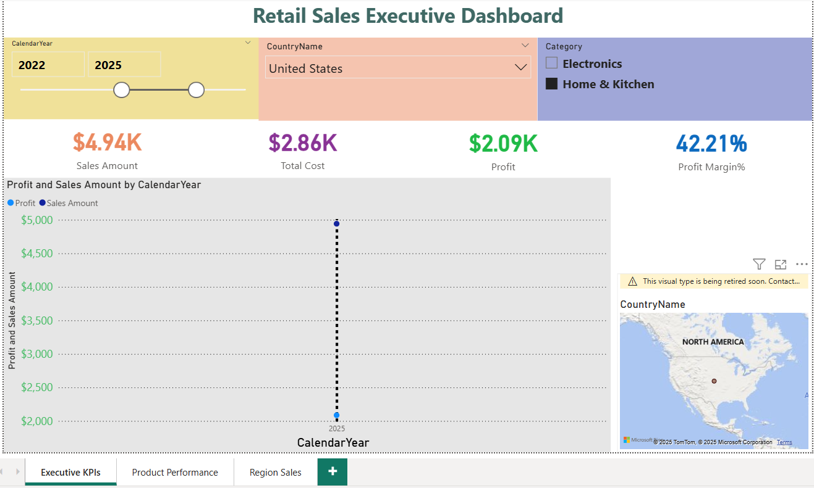
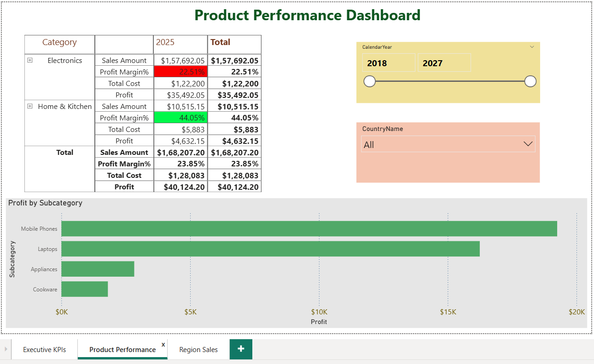
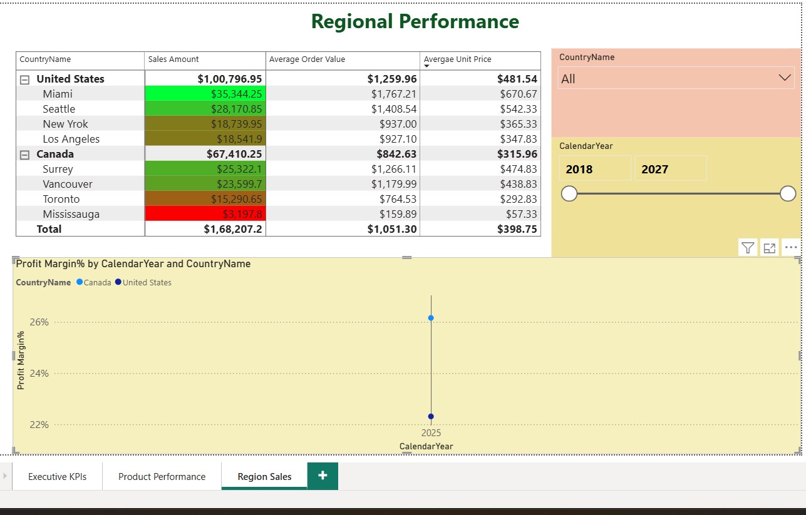

# Retail Sales Analytics — End-to-End Microsoft BI Project  

**Technologies:** SQL Server | SSIS | SSAS | Power BI | Git & GitHub  

---

##  Project Summary  

This project demonstrates the design of a full Microsoft BI pipeline — from raw CSVs to Power BI dashboards — showcasing ETL, data modeling, analytics, and reporting skills. I built it to simulate a real-world retail sales analytics environment, integrating data from multiple sources into a clean, analytical model.  

---

## Quick Highlights  

- **ETL (SSIS):** Extract, clean, and load data from CSVs to a SQL Data Warehouse  
- **Modeling (SSAS):** Star schema cube with measures, hierarchies, and KPIs  
- **Visualization (Power BI):** Interactive dashboards with slicers, KPIs, and drillthrough  
- **Version Control (GitHub):** Structured repo with docs and screenshots  

---

## Repository Structure  

| Folder | Description |
|--------|--------------|
| `src/sql` | SQL scripts for schema, seed, and warehouse |
| `src/ssis` | ETL packages for dimension and fact loads |
| `src/ssas` | SSAS cube and dimension definitions |
| `powerbi` | Power BI reports (PBIX import version) |
| `docs` | Setup guide, architecture notes, screenshots |

---

## Live Demo 
[Open Power BI report](https://app.powerbi.com/view?r=eyJrIjoiMDliYjg2NTQtMTUzZi00MTc4LTkwYTUtYjZkNjMzZTI3ZDM4IiwidCI6IjkxMzhiMzE3LTk0MjktNDE4Mi05YmRjLTc1M2ZlYmJiMjJiNiJ9)

## Screenshots  

---

## How to Run Locally  

See [docs/SETUP.md](docs/setup.md.txt) for detailed setup instructions.  

---

## Architecture & Learning  

See [docs/ARCHITECTURE.md](docs/ARCHITECTURE.md) for data model design, pipeline flow, and issues resolved.  

---

## Author  

**Aashya Bodugula**  
📍 Toronto, Canada  
📧 [aashya0409@gmail.com](mailto:aashya0409@gmail.com)  
🔗 [LinkedIn](https://www.linkedin.com/in/aashyam/)  

---

## License  

Open source under the MIT License.  
⭐ If you find this project helpful, please star the repo!

